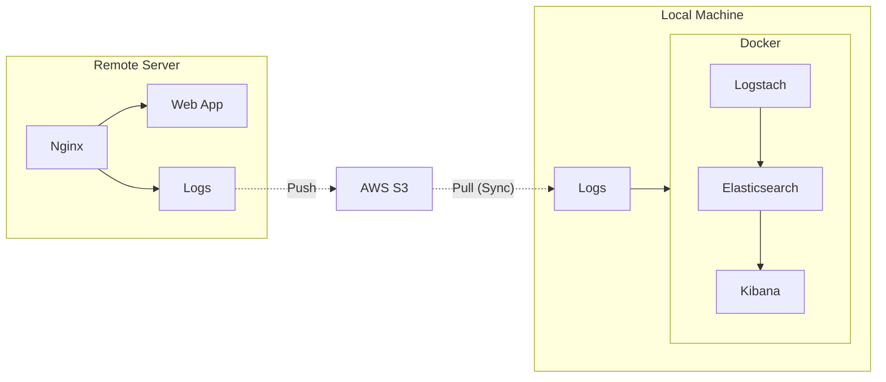

# Almost Free ELK Analytics

This is a simple ELK stack setup that can be used to analyse logs from your remote server on your local machine. 

At present, this only works for Nginx logs giving you the ability to analyse the logs in Kibana.

## Contents
- [Almost Free ELK Analytics](#almost-free-elk-analytics)
  - [Contents](#contents)
  - [Why?](#why)
  - [How?](#how)
  - [Limitations](#limitations)
  - [Setup](#setup)
    - [AWS](#aws)
    - [Remote Server](#remote-server)
      - [Prerequisites](#prerequisites)
    - [Local Machine](#local-machine)
      - [Prerequisites](#prerequisites-1)
  - [Adhoc Runs](#adhoc-runs)
  - [Further Development](#further-development)
  - [Issues](#issues)


## Why?

I wanted to analyse my Nginx log and get an understanding of the traffic - specifically understand when things go wrong. I didn't want to pay for a third party service and nor did I want to deploy a full ELK stack on my server.

Instead, I wanted a cost effective solution that I could run on my local machine and analyse the logs from my remote server.

## How?

My server produces Nginx logs and I use a cron job to copy the logs to an S3 bucket. Whenever I want to analyse the logs, I run a script that downloads the logs from S3 and processes them using Logstash (I could also use an cron job instead). The processed logs are then stored in Elasticsearch and visualised in Kibana.



## Limitations

* This setup only works for Nginx logs.
* The setup only works for logs that are stored in a file.
* The setup only works for logs that are stored in an S3 bucket.
* The setup only works for logs that are stored in a specific format. The format is `logstash-nginx-log-format` which is the default format for Nginx logs.


## Setup

### AWS

1. Create an S3 bucket to store the logs.
2. Ensure that your remote server has the necessary permissions to write to the S3 bucket. Below is an example an policy you can use:

```json
{
    "Version": "2012-10-17",
    "Statement": [
        {
            "Sid": "<< Some identifier >>",
            "Effect": "Allow",
            "Action": "s3:PutObject",
            "Resource": "arn:aws:s3:::<< bucket_name >>/*"
        },
        {
            "Sid": "<< Some indentifier >>",
            "Effect": "Allow",
            "Action": "s3:ListBucket",
            "Resource": "arn:aws:s3:::<< bucket_name >>"
        }
    ]
}
```

3. Ensure that your local machine has the necessary permissions to read from the S3 bucket. Below is an example policy you can use:

```json
{
    "Version": "2012-10-17",
    "Statement": [
        {
            "Sid": "<< Some identifier >>",
            "Effect": "Allow",
            "Action": "s3:GetObject",
            "Resource": "arn:aws:s3:::<< bucket_name >>/*"
        },
        {
            "Sid": "<< Some identifier >>",
            "Effect": "Allow",
            "Action": "s3:ListBucket",
            "Resource": "arn:aws:s3:::<< bucket_name >>"
        }
    ]
}
```

### Remote Server

#### Prerequisites

* Nginx - specifically, you need to have Nginx setup to log to a file.
* AWS CLI

1. Setup Nginx to log to a file. The default location is `/var/log/nginx/access.log`. If you change the location, you will need to update the `push_logs_to_s3.sh` script.
2. Copy the `push_logs_to_s3.sh` script to your remote server.
3. Create a cron job to run the `push_logs_to_s3.sh` script. Below is an example cron job that runs every 3 hours:

```bash
0 */3 * * * /path/to/push_logs_to_s3.sh <bucket_name>
```

### Local Machine

#### Prerequisites

* Docker
* Docker Compose
* AWS CLI

1. Clone this repository.
2. Create a cron job to run the `pull_logs_from_s3.sh` script. Below is an example cron job that runs every 3 hours:

```bash
0 */3 * * * /path/to/pull_logs_from_s3.sh <bucket_name>
```

3. Run the following command to start the ELK stack:

```bash
docker-compose up
```
4. Navigate to `http://localhost:5601` to access Kibana.
5. Click on the `Discover` tab and create an index pattern. The index pattern should be `nginx-logs*`.
6. You should now be able to visualise the logs in Kibana.

## Adhoc Runs

If you want adhoc runs, you can execute the `push_logs_to_s3.sh` in your remote server and `pull_logs_from_s3.sh` in your local machine.

## Further Development

At the moment, this project is as-is. There are plenty of things that can be done to improve the project. For now, it serves my purpose and so I am likely to not make any further changes unless I need to.

That said, if you have any suggestions or improvements, feel free to create an issue or a pull request. I will be more than happy to review them.

## Issues

If you encounter any issues, please create an issue and I will try to help you as best as I can. Bare in mind, this is a simple setup that I've knocked up in a few hours. It is not production ready and nor is it intended to be.
