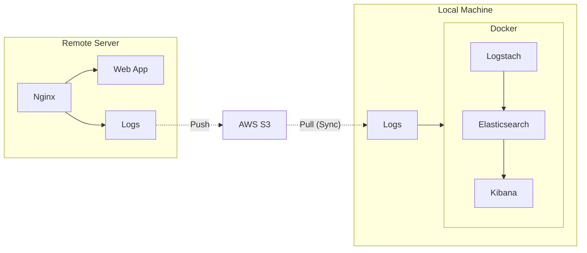

# Almost Free ELK Analytics

This repository provides a simple, cost-effective ELK stack setup for analysing NGINX logs from a remote server on your local machine. By keeping everything local, there's no need for expensive third-party services or provisioning cloud servers to run ELK.

At present, this setup only works with NGINX logs, giving you the ability to analyse and visualise them directly in Kibana.

## Contents
- [Almost Free ELK Analytics](#almost-free-elk-analytics)
  - [Contents](#contents)
  - [Why?](#why)
  - [How?](#how)
  - [Limitations](#limitations)
  - [Setup](#setup)
    - [AWS](#aws)
    - [Remote Server](#remote-server)
      - [Prerequisites](#prerequisites)
    - [Local Machine](#local-machine)
      - [Prerequisites](#prerequisites-1)
  - [Adhoc Runs](#adhoc-runs)
  - [Further Development](#further-development)
  - [Issues](#issues)


## Why?

I wanted to gain deeper insights into my NGINX logs to understand traffic patterns and identify errors, especially when things go wrong. However, I didn’t want to rely on expensive third-party log analysis services, nor did I want to deploy a full ELK stack on my server.

This project aims to provide a cost-effective solution for log analysis that runs entirely on your local machine, but processes logs from a remote server.

## How?


The server generates NGINX logs, which are periodically uploaded to an S3 bucket via a cron job. When you want to analyse these logs, a script is run locally to download the logs from S3 and process them using Logstash. The processed logs are then stored in Elasticsearch and visualized in Kibana.




## Limitations

Currently, this setup is designed to work only with NGINX logs.
The logs must be stored as files on the remote server.
Only logs stored in an S3 bucket are supported.
The setup assumes the default NGINX log format, so any customisations may require changes to the Logstash configuration.

## Setup

### AWS

1. Create an S3 bucket to store the logs.
2. Configure the remote server with permissions to write to the S3 bucket. Example policy:

```json
{
    "Version": "2012-10-17",
    "Statement": [
        {
            "Sid": "<< Some identifier >>",
            "Effect": "Allow",
            "Action": "s3:PutObject",
            "Resource": "arn:aws:s3:::<< bucket_name >>/*"
        },
        {
            "Sid": "<< Some indentifier >>",
            "Effect": "Allow",
            "Action": "s3:ListBucket",
            "Resource": "arn:aws:s3:::<< bucket_name >>"
        }
    ]
}
```

3. Grant your local machine the necessary permissions to read from the S3 bucket:

```json
{
    "Version": "2012-10-17",
    "Statement": [
        {
            "Sid": "<< Some identifier >>",
            "Effect": "Allow",
            "Action": "s3:GetObject",
            "Resource": "arn:aws:s3:::<< bucket_name >>/*"
        },
        {
            "Sid": "<< Some identifier >>",
            "Effect": "Allow",
            "Action": "s3:ListBucket",
            "Resource": "arn:aws:s3:::<< bucket_name >>"
        }
    ]
}
```

### Remote Server

#### Prerequisites

* NGINX installed and configured to log to a file (default location is /var/log/nginx/access.log).
* AWS CLI installed and configured for S3 access.

1. Configure NGINX to log to a file. If the log location differs from the default, update the `push_logs_to_s3.sh` script accordingly.
2. Copy the `push_logs_to_s3.sh` script to your remote server.
3. Create a cron job to run the `push_logs_to_s3.sh` script. Below is an example cron job that runs every 3 hours:

```bash
0 */3 * * * /path/to/push_logs_to_s3.sh <bucket_name>
```

### Local Machine

#### Prerequisites

* Docker
* Docker Compose
* AWS CLI

1. Clone this repository.
2. Create a cron job to run the `pull_logs_from_s3.sh` script. Below is an example cron job that runs every 3 hours:

```bash
0 */3 * * * /path/to/pull_logs_from_s3.sh <bucket_name>
```

3. Start the ELK stack by running:

```bash
docker-compose up
```
4. Navigate to `http://localhost:5601` to access Kibana.
5. Click on the `Discover` tab and create an index pattern. Use `nginx-logs*` as the index pattern.
6. You should now be able to visualise the NGINX logs in Kibana.

## Adhoc Runs

To run the process manually, you can execute the `push_logs_to_s3.sh` script on your remote server and the `pull_logs_from_s3.sh` script on your local machine.

## Further Development

Currently, this project is a basic setup that meets my needs. Future enhancements could include:

* Supporting logs from other web servers beyond NGINX.
* Adding support for additional log storage formats (besides S3).
* Further automation of the log processing pipeline.

If you have ideas or suggestions, feel free to submit a pull request or open an issue. Contributions are welcome!

## Issues

If you encounter any problems, please create an issue. This setup is a quick solution I developed over a few hours, so it may not be production-ready. I'll do my best to help, but bear in mind it's not designed for large-scale production environments.
